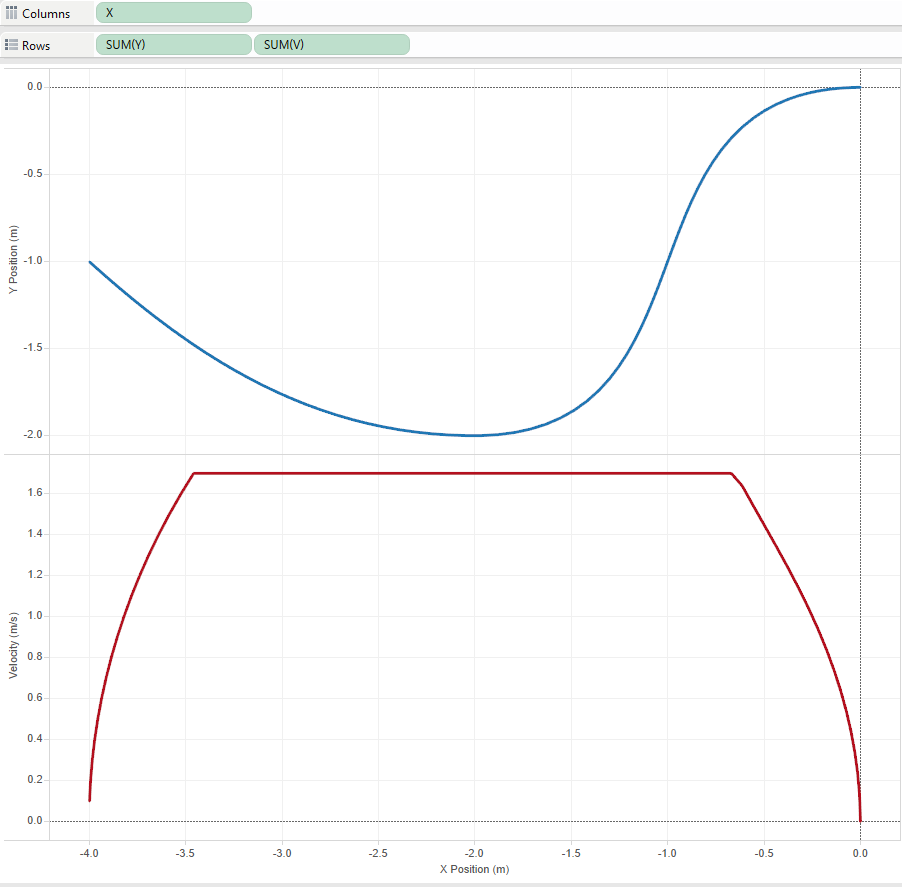
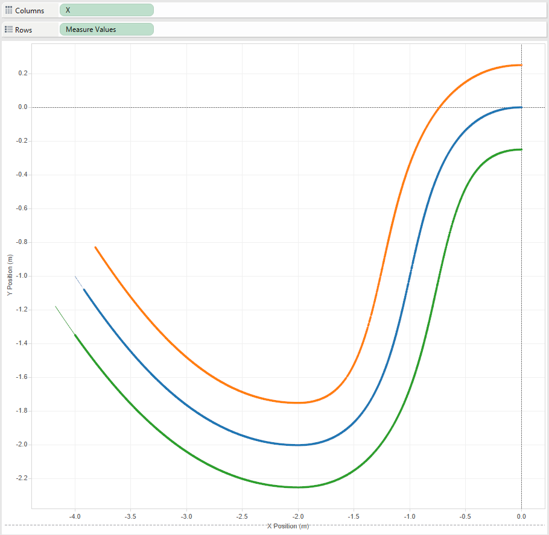
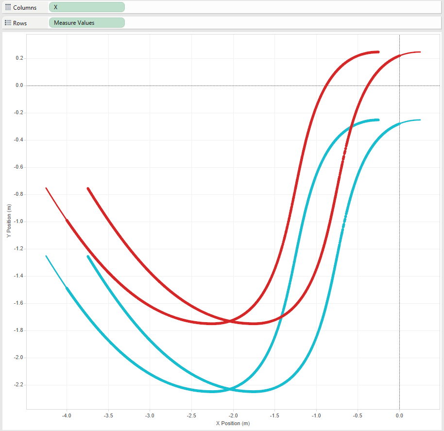

# Pathfinder
Cross-Platform, Multi-Use Motion Profiling and Trajectory Generation.

Pathfinder is a library for generating Motion Profiles, a way to smoothly fit and follow a trajectory based upon 
given waypoints. Currently, both a C and Java API are available, but can be applied to almost any application.

An example profile is given below, with the waypoints:  
1) X = -4, Y = -1, Angle = -45 degrees  
2) X = -2, Y = -2, Angle = 0  
3) X = 0,  Y = 0,  Angle = 0

The Graph on top is the X/Y position, and the Graph on the bottom is the Velocity.  


## Modifiers
Pathfinder supports Modifiers. Modifiers are a way to manipulate a trajectory with a given rule.  
Pathfinder supports Tank and Swerve Drive modifiers.  

Tank Drive:  


Swerve Drive:  


## Part of the FIRST Robotics Competition?
Add the following lines to your build.gradle if you're using GradleRIO (2018.01.11 or higher):

### Java:
```gradle
dependencies {
    compile pathfinder()
}
```

### C++:
```gradle
model {
    frcUserProgram(NativeExecutableSpec) {
        lib library: "pathfinder"
    }
}
```

**If you're not using GradleRIO, do the following:**  
### Java
If you're not using GradleRIO, you must download this manually and copy into `~/wpilib/user/java/lib`: http://dev.imjac.in/maven/jaci/pathfinder/Pathfinder-Java/1.8/Pathfinder-Java-1.8.jar  
You also have to download this, extract it, and place `libpathfinder.so` into `~/wpilib/user/java/lib`: http://dev.imjac.in/maven/jaci/pathfinder/Pathfinder-JNI/1.8/Pathfinder-JNI-1.8-athena.zip

### C++
Download this and put `libpathfinder.a` in `~/wpilib/user/cpp/lib`: http://dev.imjac.in/maven/jaci/pathfinder/Pathfinder-Core/1.8/Pathfinder-Core-1.8-athena.zip   
Download this and extract all of its contents to `~/wpilib/user/cpp/include`: http://dev.imjac.in/maven/jaci/pathfinder/Pathfinder-Core/1.8/Pathfinder-Core-1.8-headers.zip   

## Building / Installing on your Architecture
If you want to use Pathfinder on your system, you will have to build the library for your platform. You can do this with the following:

```java
./gradlew build
```

The native libraries will be located under `./Pathfinder-Core/build/libs/pathfinder/` (shared and static libs, platform=any64) and `./Pathfinder-Java/build/libs/pathfinderjava/shared/any64`. If you're using native shared (or java), you must put these somewhere on your system load path (e.g. Mac/Linux = `/usr/local`, Windows = Somwhere on PATH)

## Usage
To see the usage for each language variation of the API, see the README in their folder.

| Language | Folder |
| -------- | ------ |
| C        | [Pathfinder-Core](Pathfinder-Core/) |
| Java     | [Pathfinder-Java](Pathfinder-Java/) |
| LabVIEW  | [Pathfinder-LabVIEW](Pathfinder-LabVIEW/) |

## Other languages

The RobotPy project has created python bindings around the Pathfinder libraries, and can be found at https://github.com/robotpy/robotpy-pathfinder
